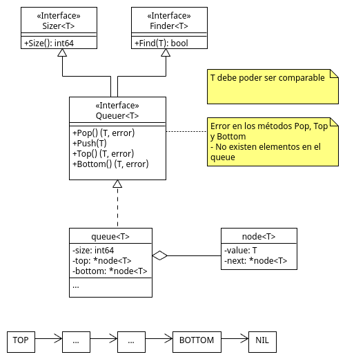

# Data Structures with Golang

A compilation of data structures made in golang.

## Check on Youtube

A spanish playlist explaining all structures on this repository.

[Estructura de datos con Golang](https://www.youtube.com/playlist?list=PLFUBk0vf6VP9tm4T4d5-tnutLFwtq6lo0)

## Data structures

### Stack

### Queue

### Simple Linked List

### Double Linked List

